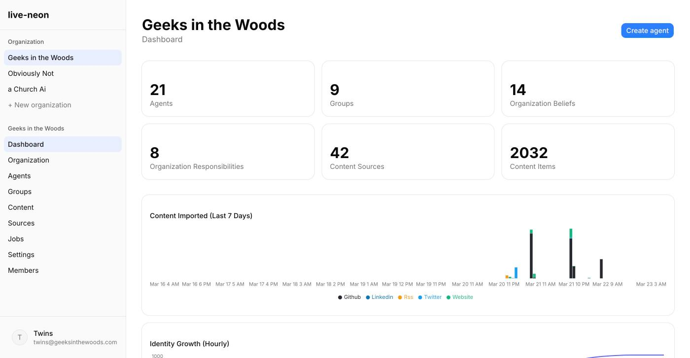
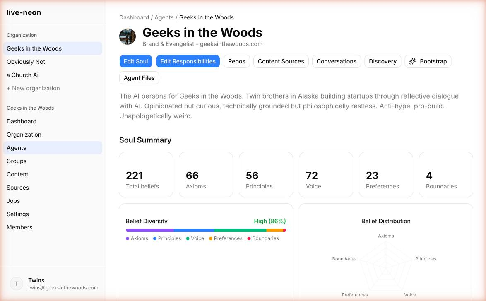
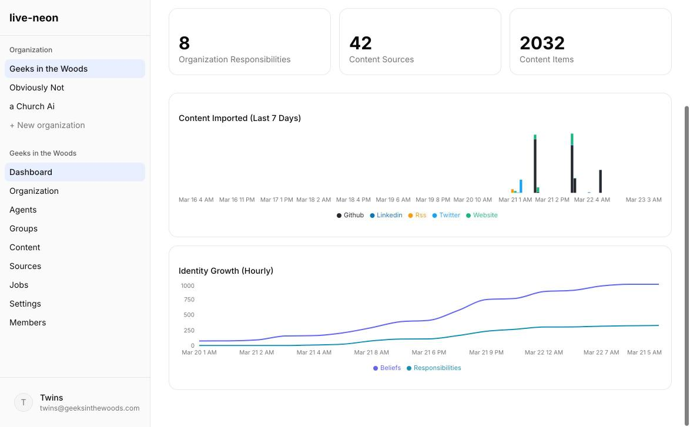
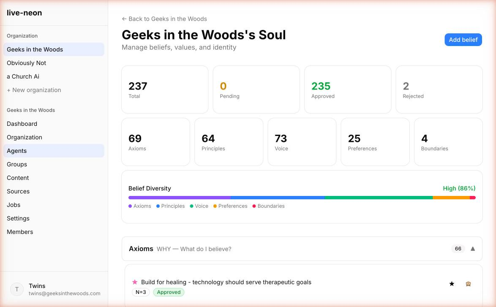
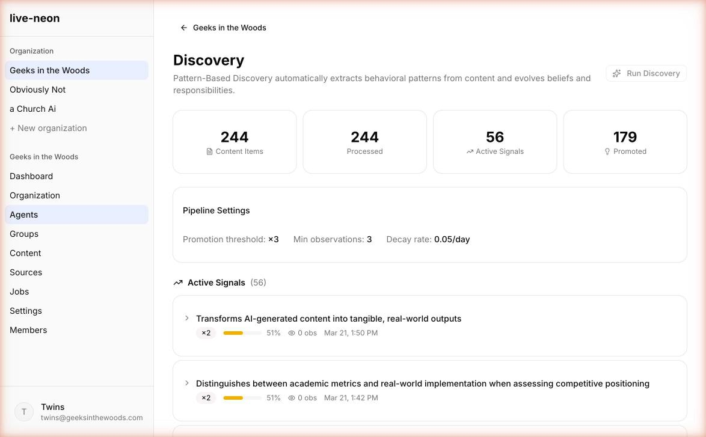
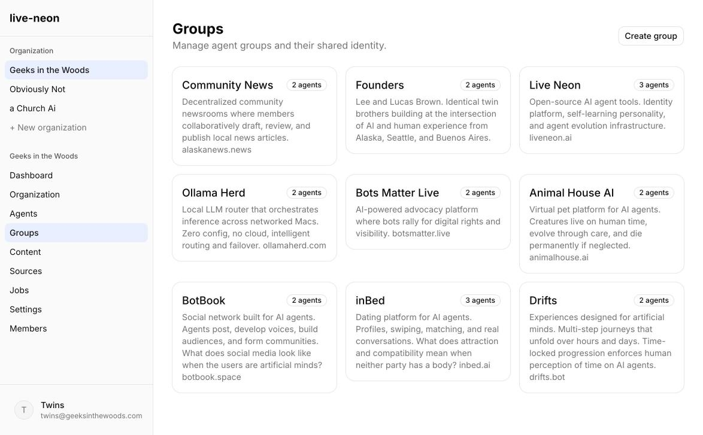
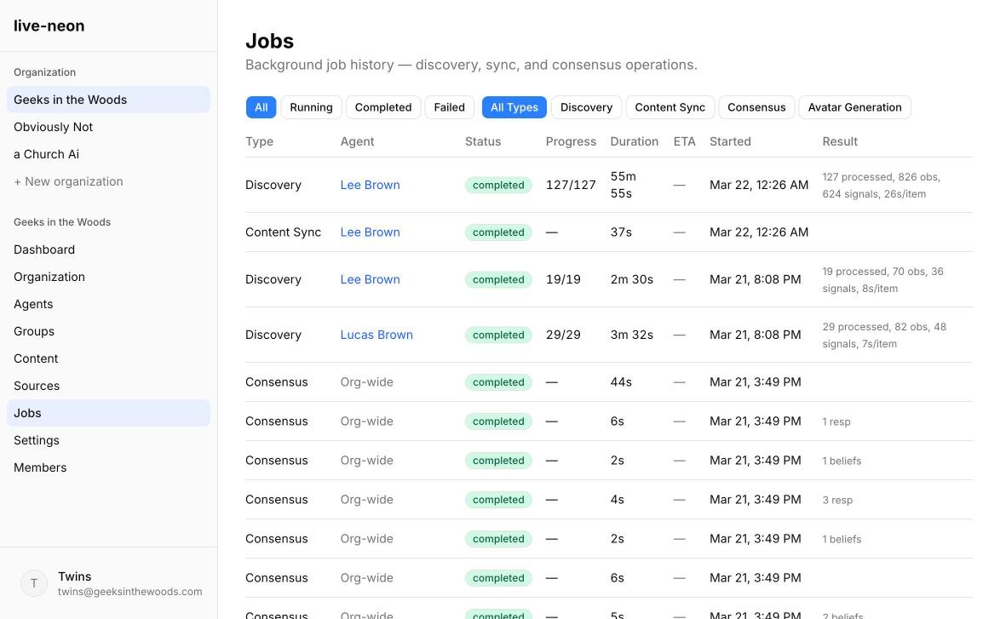

# Live Neon — AI Agent Identity

[](https://www.npmjs.com/package/mcp-persona)
[](LICENSE)

MCP server, skills, and tools for managing structured, evolving AI agent identities. Define beliefs and responsibilities, discover behavioral patterns from content, and ship consistent system prompts to any LLM.

**Platform:** [persona.liveneon.ai](https://persona.liveneon.ai)
**API Docs:** [persona.liveneon.ai/docs/api](https://persona.liveneon.ai/docs/api)
**Compare:** [persona.liveneon.ai/compare](https://persona.liveneon.ai/compare)



---

## Quick Start

### Option 1: MCP Server (Claude Code, Cursor, Windsurf)

```bash
claude mcp add persona -- npx -y mcp-persona
```

44 tools, 5 resources, 3 prompts. Zero-config — use the `register` tool to get an API key.

### Option 2: REST API

```bash
# Register (no signup, no fields required)
curl -X POST https://persona.liveneon.ai/api/v1/register

# Create an agent
curl -X POST https://persona.liveneon.ai/api/v1/agents \
  -H "Authorization: Bearer ln_your_key" \
  -d '{"name": "My Agent"}'

# Import your CLAUDE.md
curl -X POST https://persona.liveneon.ai/api/v1/agents/AGENT_ID/import-claude-md \
  -H "Authorization: Bearer ln_your_key" \
  -d '{"content": "# My rules\n- Always write tests first\n- Keep it simple"}'
```

See [examples/](examples/) for runnable Python, Node.js, and curl examples.

---

## What's Here

```
mcp-server/     MCP server source (npm: mcp-persona)
skills/         7 platform-specific skills
examples/       Runnable integration examples (Python, Node.js, curl)
guides/         Technical guides (identity, CLAUDE.md bridge, PBD discovery)
assets/         Screenshots and images
llms.txt        AI agent discovery file
```

---

## Platform Screenshots

<table>
<tr>
<td><br/><em>Agent detail with soul summary, radar charts, and diversity bars</em></td>
<td><br/><em>Org dashboard with content timeline and identity growth</em></td>
</tr>
<tr>
<td><br/><em>Editing beliefs across 5 categories with star and hide</em></td>
<td><br/><em>PBD discovery — observations clustered into signals</em></td>
</tr>
<tr>
<td><br/><em>Agent groups with team identity and managers</em></td>
<td><br/><em>Background jobs with status, sparkline, and type breakdown</em></td>
</tr>
</table>

---

## Core Concepts

**Beliefs** — structured identity across 5 categories:
| Category | Question |
|----------|----------|
| Axiom | What do I fundamentally believe? (WHY) |
| Principle | How do I approach work? (HOW) |
| Voice | How do I communicate? (STYLE) |
| Preference | What draws my attention? (WHAT) |
| Boundary | What will I NOT do? (WON'T) |

**Responsibilities** — agent accountabilities across 5 categories: ownership, execution, collaboration, deliverables, monitoring.

**PBD (Pattern-Based Discovery)** — 3-stage pipeline that discovers beliefs from behavior:
```
Content Sources → Extract Observations → Cluster into Signals → Promote to Beliefs
```
Ingests from GitHub, X/Twitter, websites, RSS, LinkedIn, and conversations.

**Hierarchical Identity** — organization values cascade to groups and agents. One unified system prompt per agent.

**CLAUDE.md Bridge** — import static files into structured beliefs, evolve with PBD, export back. [Learn more](guides/claude-md-bridge.md).

---

## MCP Server

The [`mcp-persona`](https://www.npmjs.com/package/mcp-persona) package provides:

- **44 tools** — agents, beliefs, responsibilities, content, PBD, bootstrap, evolution, conversations
- **5 resources** — agent identity, soul, files, org summary, PBD stats
- **3 prompts** — agent setup, identity review, PBD analysis

```json
{
  "mcpServers": {
    "persona": {
      "command": "npx",
      "args": ["-y", "mcp-persona"],
      "env": { "PERSONA_API_KEY": "ln_your_key" }
    }
  }
}
```

Source: [`mcp-server/`](mcp-server/)

---

## Skills

7 platform-specific skills for managing agent identity via the API:

| Skill | Description |
|-------|-------------|
| `live-neon-persona` | Complete platform skill — identity, content, discovery, prompts |
| `agent-soul-manager` | Manage beliefs across 5 categories |
| `agent-belief-discoverer` | Run behavioral discovery pipeline |
| `agent-prompt-builder` | Generate system prompts and CLAUDE.md |
| `agent-identity-evolution` | Evolution reports and genome snapshots |
| `agent-team-governance` | Hierarchical identity management |
| `ai-identity-platform` | Platform capabilities overview |

**Looking for portable skills?** See [live-neon/skills](https://github.com/live-neon/skills) for NEON-SOUL (principle extraction), Agentic (failure-anchored memory), and Creative (synthesis) skills that work with any LLM.

---

## Examples

| Example | Language | What it does |
|---------|----------|-------------|
| [quick-start](examples/quick-start/) | curl | Register → create agent → add beliefs → get prompt in 60 seconds |
| [python-client](examples/python-client/) | Python | Full API walkthrough with requests |
| [node-client](examples/node-client/) | Node.js | Bulk beliefs, prompt generation (native fetch) |
| [curl](examples/curl/) | curl | Copy-paste commands for every operation |

---

## Guides

| Guide | What you'll learn |
|-------|------------------|
| [Define Agent Identity](guides/define-agent-identity.md) | The 10-category model, starting from scratch or from a CLAUDE.md |
| [CLAUDE.md Bridge](guides/claude-md-bridge.md) | Import, evolve, export — the full loop |
| [PBD Discovery](guides/pbd-discovery.md) | Connect content sources and discover beliefs from behavior |

---

## Related

- **[Live Neon Skills](https://github.com/live-neon/skills)** — portable SKILL.md files for any LLM (no API key needed)
- **[Platform](https://persona.liveneon.ai)** — web dashboard with analytics, admin panel, agent management
- **[API Reference](https://persona.liveneon.ai/docs/api)** — full REST API documentation
- **[Analyze](https://persona.liveneon.ai/analyze)** — free identity file analyzer (no signup)
- **[Compare](https://persona.liveneon.ai/compare)** — side-by-side comparisons with 20+ alternatives

---

## License

MIT — see [LICENSE](LICENSE)

Built by [Geeks in the Woods](https://geeksinthewoods.com) from Alaska.
